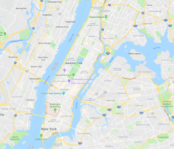

## Greenwich Village

### Detailed Information

Zip Codes: 10003, 10011, 10012, 10014

Census Tracts: 0055.01, 0057.00, 0059.00, 0061.00, 0063.00, 0065.00, 0067.00, 0069.00,
0071.00, 0073.00, 0075.00, 0077.00, 0079.00

Map of New York City with your neighborhood highlighted:

A photo or image that captures your neighborhood:

The demographics of your neighborhood: Predominantly Non-Hispanic White

The distance of your neighborhood to Federal Hall: 2.0 miles

And to Empire State Building: 1.5 miles

### Accessible Locations

### Turnstile Data

### L Train Shutdown Effects

	In Greenwich Village, closure of the L in the 14th street and 8th avenue station would greatly affect people commuting into Brooklyn and into the east side of Manhattan. There aren’t many other ways to get to the east side or into Brooklyn. The turnstile data does not accurately depict how many people will be affected by this closure because the station also operates ACE trains. There is a bus that runs along 14th street in Manhattan which means people can take it in lieu of the L train. However, it is estimated to take a significantly longer time. In order to get from 14th street and 8th avenue to 14th street and 1st avenue, it takes approximately an extra twenty minutes. In order to get to Brooklyn from the city, commuters will need to take significant detours which may add up to on hour to their commute so a ferry where the L train goes into Brooklyn may be helpful as well as a bus that runs the same route as the L train in Brooklyn. Since the closure is lasting 15 months, this would be a good short time compromise.
